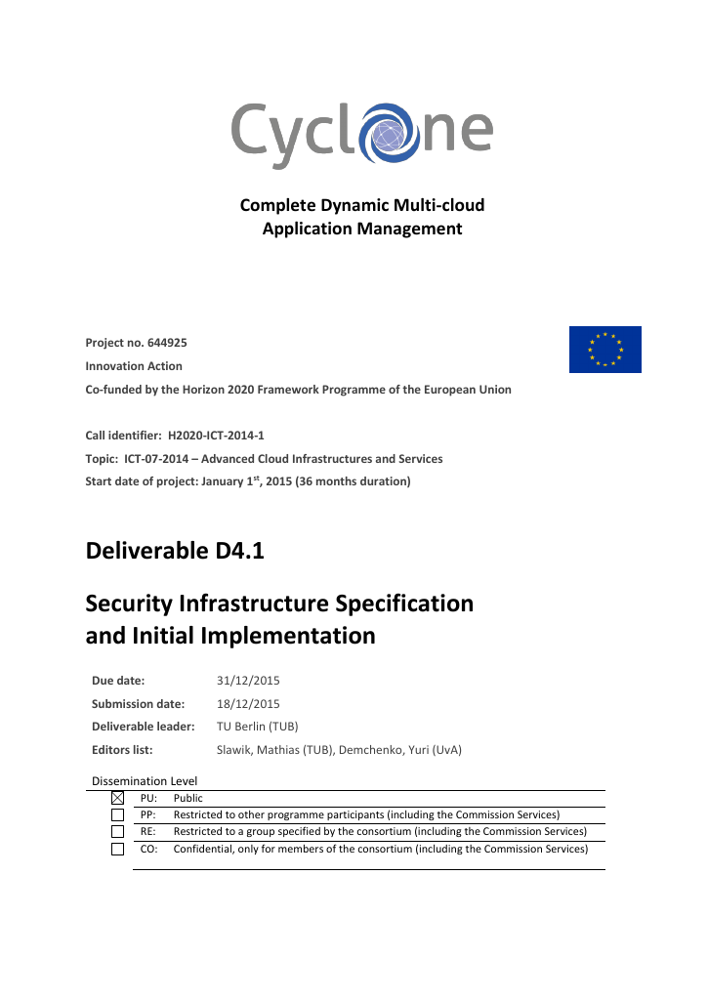

<h1>The CYCLONE system architecture</h1>

{: .lead}
CYCLONE provides an integrated software stack that enables a wealth of functionality, such as multi-cloud deployment and scaling of federated applications, secure access control using federated identities, as well as software-defined networking functions.

Our project deliverable 4.1 gives you a comprehensive overview about our architecture. You can also contact [Mathias](/contact.html#mathias-slawik) for more information in this matter.

{:.preview}



  

 

